# MNT-DEMO-ATM-002 — Eight-Scene Storyboard and Implementation Blueprint

## Status

- Blueprint version: `1.1.0`
- Status: Awaiting visual approval
- Prepared on: `2026-08-14`
- Parent contract: `MNT-DEMO-ATM-001 v1.0.1`
- Parent commit: `f2265d36b3844034a39ce2459418d1464b08342c`
- Source baseline: `ae475d5cac324f59ee654c2b2db1825bbdc9de60`
- Target scenario: `atm-field-service`
- Capability profile: `execution-only`
- Distribution: `public-demo`

## Outcome

Translate the frozen ATM field-service contract into an implementation-ready walkthrough. This
blueprint defines the eight scenes, screen hierarchy, actor transitions, seeded data, domain
extensions, reusable components, state changes, validation behavior, operational report, and QA
gates.

It does not implement the scenario. It removes product and interaction ambiguity before the build
increment begins.

## Control brief

- **Objective:** give product, design, and development one implementable definition of the ATM demo.
- **Audience:** Zellship product, demo, design, and frontend implementation teams.
- **Decision enabled:** authorize the scenario build without asking development to invent workflow,
  data, authority, or screen behavior.
- **Included:** eight-scene narrative, screen contracts, state transitions, seed states, shared
  component plan, domain changes, responsive behavior, simulation disclosure, and acceptance tests.
- **Excluded:** production integrations, real client assets, prices, Improvement, Executive,
  backend work, and a second complete preventive walkthrough.
- **Completion condition:** every scene has an entry state, actor, screen, primary action, state
  mutation, visible proof, exit state, and testable criterion.

## Frozen inputs

This blueprint preserves all decisions in `MNT-DEMO-ATM-001`:

- 24 hours applies only to accepting corrective orders;
- preventive work follows advance monthly planning;
- service type, installation class, and access context are separate dimensions;
- concepts and quantities are included without prices;
- the supervisor can approve, reject, and reopen; the coordinator can approve and reopen;
- poor work or incomplete evidence can trigger rejection or reopening;
- Improvement and Executive capabilities remain excluded;
- bank/client remains an external recipient, not a demo login role.

## Narrative recommendation

Use one corrective order as the continuous story. Keep preventive work visible in the coordinator's
queue and calendar to prove the second operating path without dividing attention between two full
journeys.

The corrective story should expose two risks in order:

1. the provider may lose the order if it does not accept it in time;
2. the provider may fail closure if evidence is incomplete or bound to the wrong site.

The narrative closes with a corrected revision and an approved operational report. It should not
continue into performance dashboards or improvement recommendations.

## Story flow

```mermaid
flowchart LR
  S1[1. Corrective intake] --> S2[2. Accept and classify]
  S2 --> S3[3. Schedule and prepare access]
  S3 --> S4[4. Mobile arrival and check-in]
  S4 --> S5[5. Guided pre-evidence]
  S5 --> S6[6. Execute and submit]
  S6 --> S7[7. Reject, reopen, and correct]
  S7 --> S8[8. Approve and generate report]

  P[Monthly preventive plan] -. supporting context .-> S1
  P -. supporting context .-> S3
```



## Walkthrough contract at a glance

| Scene | Actor                       | Surface                       | Primary decision                                            | Entry state          | Exit state                      |
| ----- | --------------------------- | ----------------------------- | ----------------------------------------------------------- | -------------------- | ------------------------------- |
| 1     | Coordinator                 | Corrective intake             | Which order needs immediate response?                       | `AwaitingAcceptance` | Selected order                  |
| 2     | Coordinator                 | Service order detail          | Accept and apply the correct operating path.                | `AwaitingAcceptance` | `Accepted`                      |
| 3     | Coordinator                 | Planning and access readiness | Who can attend, when, and under which access conditions?    | `Accepted`           | `AccessReady`                   |
| 4     | Technician                  | Mobile assignment             | Is the technician at the correct site and able to enter?    | `AccessReady`        | `InProgress`                    |
| 5     | Technician                  | Guided evidence               | Is the required starting evidence complete and site-bound?  | `InProgress`         | Pre-evidence complete           |
| 6     | Technician                  | Execution and submission      | What was done and is the package complete enough to submit? | `InProgress`         | `PendingValidation`, revision 1 |
| 7     | Supervisor, then technician | Validation and correction     | Does the package prove correct execution?                   | `PendingValidation`  | `PendingValidation`, revision 2 |
| 8     | Coordinator                 | Final validation and report   | Can the corrected revision be approved and delivered?       | `PendingValidation`  | `Closed`                        |

## Experience principles

1. **Operational urgency before analytics.** The first screen answers what needs action now.
2. **One primary action per scene.** Supporting details must not compete with the decision.
3. **Data captured once.** Site, service, protocol, evidence, and concepts flow into the report.
4. **Exceptions are explicit states.** Lost work, false visits, rejection, and reopening are not
   hidden in notes.
5. **Evidence belongs to an order and site.** A photo is not valid merely because it exists.
6. **Role changes are deliberate.** Coordinator, technician, and supervisor see the same record from
   their responsibility.
7. **Simulation remains visible.** GPS, camera, integrity checks, notifications, and delivery must
   never look like live integrations.
8. **No visual redesign of the base shell.** Reuse the current Zellship navigation, cards, drawers,
   tables, status tags, forms, mobile shell, and print foundation.

## Scene 1 — New corrective order

### Purpose

Make the commercial risk visible immediately: a new corrective service must be accepted before the
24-hour window expires or it will be assigned elsewhere.

### Screen contract

- **Role:** Coordinator (`admin`).
- **Surface:** new `ServiceInbox` inside the existing Work Orders capability.
- **Viewport:** desktop, designed first at 1440 px.
- **Entry:** seeded corrective order `SO-ATM-2401` is awaiting acceptance with four deterministic
  hours remaining.

### Layout

1. Header: `Servicios recibidos` with the subtitle `Correctivos por aceptar y preventivos
programados`.
2. Urgency strip: count of corrective orders awaiting response, next deadline, and one lost order.
3. Primary card: selected corrective order with countdown, received time, symptom summary,
   installation class, access context, and service location label.
4. Secondary queue: preventive monthly work and non-primary corrective examples.
5. Primary action: `Revisar y aceptar`.
6. Secondary action: `Declinar`; requires confirmation and explains that the service will be lost.

### Exact information hierarchy

- Order: `SO-ATM-2401`.
- Service type: `Correctivo`.
- Installation: `REMOTO`.
- Access context: `Comercio`.
- Status: `Por aceptar`.
- Countdown label: `4 h restantes para aceptar`.
- Disclaimer: `Tiempo y notificación simulados para esta demostración`.

### Interaction and state

- Selecting `Revisar y aceptar` opens Scene 2 without mutating the order.
- Declining is available but is not used in the primary walkthrough.
- An already expired seed is read-only and labeled `Servicio perdido`.

### Proof and exit

The audience can distinguish the acceptance deadline from any later service deadline. The selected
record remains `AwaitingAcceptance` until Scene 2 confirms acceptance.

## Scene 2 — Acceptance and protocol resolution

### Purpose

Show that accepting the work creates an operational commitment and resolves the protocol from
separate classification dimensions.

### Screen contract

- **Role:** Coordinator.
- **Surface:** full service-order detail page or large drawer, not a small confirmation modal.
- **Entry:** `SO-ATM-2401` remains `AwaitingAcceptance`.

### Layout

1. Order header with countdown and immutable received data.
2. `Clasificación operativa`:
   - service type `Correctivo`;
   - installation class `REMOTO`;
   - access context `Comercio`.
3. `Protocolo resultante`: required access, evidence, skills, and estimated work window.
4. `Condiciones por confirmar`: appointment, technician identification, and accompaniment.
5. Primary action: `Aceptar servicio`.
6. Confirmation panel: `Al aceptar, el servicio pasa a programación. Las 24 horas corresponden
únicamente a la aceptación.`

### Interaction and state

`Aceptar servicio` records:

- accepted actor and role;
- deterministic acceptance timestamp;
- previous and new state;
- resolved protocol ID;
- audit event and simulated notification.

The service becomes `Accepted`; the countdown is replaced with `Aceptado a tiempo` and cannot be
replayed without resetting the demo.

### Proof and exit

The screen must visibly keep `REMOTO` and `Comercio` in separate labeled fields. The primary action
changes the order to `Accepted` and opens scheduling.

## Scene 3 — Scheduling, assignment, and access readiness

### Purpose

Connect the accepted commitment to a date, an eligible technician, and the conditions required to
reach the site.

### Screen contract

- **Role:** Coordinator.
- **Surface:** existing Planning experience extended with service-order context and access readiness.
- **Entry:** `SO-ATM-2401` is `Accepted` and unscheduled.

### Layout

1. Left column: service context and protocol requirements.
2. Center: date/time selector and eligible technician cards.
3. Right column: `Preparación de acceso` checklist.
4. Supporting preventive card: one monthly preventive order visible on the calendar without an
   acceptance timer.
5. Primary action: `Confirmar programación y asignación`.

### Seeded access checklist

| Requirement               | Initial state | Walkthrough action      |
| ------------------------- | ------------- | ----------------------- |
| Appointment confirmed     | Complete      | Read-only proof         |
| Technician identification | Pending       | Mark complete           |
| Security accompaniment    | Not required  | Read-only from protocol |
| Site reference            | Complete      | Read-only proof         |

Detailed bank-branch, residential-tower, and mall rules are not invented in this increment. They
may appear as catalog values, but only the commerce protocol is fully exercised.

### Interaction and state

- Only eligible fictional technicians are selectable.
- The primary action remains disabled until required access items are complete.
- Confirmation creates or links the `Schedule`, assigns the technician, records the access plan,
  and advances the service through `Scheduled`, `Assigned`, and `AccessReady`.
- A simulated assignment notification is added to the audit stream.

### Proof and exit

The selected technician can see the order in Mobile Operations. The preventive example is visibly
scheduled through the monthly path and has no corrective acceptance countdown.

## Scene 4 — Arrival, access, and check-in

### Purpose

Confirm that the assigned technician is at the intended site, inside the operating window, and able
to begin work.

### Screen contract

- **Role:** Field technician (`operator`).
- **Surface:** Mobile Operations assignment detail.
- **Viewport:** mobile, designed and verified at 390 px.
- **Entry:** service is `AccessReady` and assigned to the logged-in technician.

### Layout

1. Compact order summary: service type, installation class, access context, and protocol.
2. Access card: appointment and identification status.
3. Location card: simulated current position, assigned site label, and `Ubicación coincide` result.
4. Simulation badge: `Validación GPS simulada`.
5. Primary action: `Confirmar llegada e iniciar`.
6. Secondary exception action: `No fue posible acceder`.

### Interaction and state

The primary action creates a site-bound check-in containing order, site, technician, deterministic
timestamp, simulated coordinates, and integrity status. The schedule and execution become
`InProgress`; effective-time tracking starts.

The alternate action records `False visit — Access`, requires a photo and comment, and does not
continue through the primary walkthrough.

### Proof and exit

The check-in shows the correct order/site binding and a visible simulation disclosure. The user
cannot begin evidence capture before completing check-in.

## Scene 5 — Guided pre-intervention evidence

### Purpose

Replace an unstructured camera roll with a protocol-driven evidence manifest.

### Screen contract

- **Role:** Field technician.
- **Surface:** evidence phase inside the mobile execution flow.
- **Entry:** execution is `InProgress` with a valid check-in and no evidence captured.

### Required evidence manifest

| Sequence | Category            | Phase  | Requirement                       |
| -------- | ------------------- | ------ | --------------------------------- |
| 1        | Location/facade     | Before | One photo                         |
| 2        | ATM identifier      | Before | One photo with identifier visible |
| 3        | Site panorama       | Before | One photo                         |
| 4        | Work-area condition | Before | One photo per selected concept    |

Conditional electrical or equipment evidence appears only when the resolved protocol or selected
concept requires it.

### Layout

1. Progress header: `Evidencia previa · 1 de 4`.
2. Current requirement with instruction and fictional reference illustration.
3. `Capturar evidencia` primary action.
4. Integrity receipt after capture:
   - order bound;
   - site bound;
   - deterministic timestamp;
   - simulated location match;
   - duplicate status.
5. Manifest drawer showing complete, pending, and invalid categories.

### Interaction and state

- Captures are deterministic demo actions, not file uploads.
- Each record receives category, phase, revision, site, hash token, timestamp, and integrity status.
- A capture cannot satisfy a different category by being reused.
- Required evidence cannot be skipped.

### Proof and exit

All four pre-intervention requirements show `Completa`. The next action becomes
`Continuar a ejecución`.

## Scene 6 — Work execution and first submission

### Purpose

Record what was actually performed and create the first immutable submission revision.

### Screen contract

- **Role:** Field technician.
- **Surface:** execution form following the current mobile stepper pattern.
- **Entry:** pre-evidence is complete and execution remains `InProgress`.

### Capture sections

1. `Diagnóstico`: short structured status plus notes.
2. `Acciones realizadas`: selected and described work.
3. `Conceptos ejecutados`:
   - controlled code;
   - concept label;
   - unit;
   - executed quantity;
   - no unit price or total.
4. `Materiales y consumibles`: reserved versus actual use.
5. `Tiempo efectivo`: running timer with pause events recorded.
6. `Evidencia durante y final`: before/during/final set for each concept and final panorama.
7. `Conclusiones`: final equipment and site condition.

### Seeded first-revision defect

Revision 1 intentionally contains:

- one final photo bound to the wrong fictional site; and
- a missing final panoramic evidence item.

The technician sees a warning before submission, but the demo allows `Enviar con observaciones` so
the validation scene can demonstrate governance. The action must not present the package as clean
or approved.

### Interaction and state

Submitting creates immutable revision `R1`, records the effective time, releases demo resources,
and changes the execution to `PendingValidation`. The integrity findings travel with the revision.

### Proof and exit

The submission summary displays concepts and quantities without prices, evidence completeness,
two visible findings, revision `R1`, and `Pendiente de validación`.

## Scene 7 — Validation, rejection, reopening, and correction

### Purpose

Demonstrate that incomplete or wrong-site evidence does not disappear inside a PDF assembled after
the visit.

### Screen contract

- **Primary role:** Supervisor (`supervisor`).
- **Correction role:** Field technician.
- **Surface:** shared `ValidationWorkspace`, then mobile correction queue.
- **Entry:** revision `R1` is `PendingValidation` with two integrity findings.

### Validation layout

1. Revision header with order, site, technician, submission time, and decision status.
2. Completeness panel: required versus received evidence.
3. Integrity panel: wrong-site evidence, duplicate status, GPS/site binding, and timestamps.
4. Execution panel: diagnosis, actions, effective time, concepts, quantities, and materials.
5. Decision history.
6. Role-aware actions:
   - supervisor: `Aprobar`, `Rechazar`, and `Reabrir para corrección`;
   - coordinator: `Aprobar` and `Reabrir para corrección`.

### Walkthrough decision

The supervisor selects `Reabrir para corrección` with the required reason:
`Sustituir evidencia asociada a otro sitio y agregar panorámica final`.

This creates an attributed decision, preserves `R1`, and returns the execution to the technician as
`Reopened`.

The technician opens the correction queue, replaces the invalid evidence, captures the missing
panorama, reviews the delta, and submits `R2`.

### State and audit

The UI must retain:

- immutable `R1`;
- supervisor actor and role;
- reason and requested corrections;
- reopened timestamp;
- evidence replaced or added in `R2`;
- resubmission timestamp.

The final state is `PendingValidation` for revision `R2`, with no active integrity findings.

### Proof and exit

The audience can compare revisions and see that reopening adds a correction cycle instead of
overwriting the original report.

## Scene 8 — Coordinator approval and operational report

### Purpose

Close the service with a consolidated, traceable package that can be reviewed without manually
copying data between email, spreadsheets, forms, photos, and PDFs.

### Screen contract

- **Role:** Coordinator.
- **Surface:** shared `ValidationWorkspace` followed by `OperationalReport`.
- **Entry:** clean revision `R2` is `PendingValidation`.

### Interaction and state

The coordinator reviews the corrected delta and selects `Aprobar y cerrar`. The action records the
coordinator as decision actor, closes `R2`, closes the service order, and enables the report.

### Report hierarchy

1. Service and site identification.
2. Service type, installation class, access context, and applied protocol.
3. Reception, acceptance, scheduling, check-in, submission, reopening, resubmission, and approval
   timeline.
4. Technician or crew.
5. Antecedents, diagnosis, actions, and conclusions.
6. Effective time.
7. Materials and consumables.
8. Concepts, units, and executed quantities without prices.
9. Before, during, and final photographic evidence grouped by concept.
10. GPS/timestamp trace and simulation disclosure.
11. Validation decision and revision history.

### Available actions

- `Imprimir / Guardar como PDF` uses the browser print flow.
- `Enviar reporte` opens the existing simulated delivery modal.
- The modal must repeat that no email or WhatsApp message is actually sent.

### Final message

The final state is `Servicio cerrado · Reporte operativo consolidado`. The walkthrough ends here.
No KPI, OEE, performance ranking, or improvement view follows.

## Screen and component blueprint

### New scenario package

```text
src/demo-config/scenarios/atm-field-service/
  config.ts
  data.ts
  fieldServiceConfig.ts
  assetProfiles.ts
  resourceProfiles.ts
```

The package owns fictional identity, taxonomy, protocol configuration, service orders, seed
revisions, people, assets, schedules, and evidence. It must not copy application components.

### New reusable runtime components

| Component             | Responsibility                                               | Reuse boundary                                      |
| --------------------- | ------------------------------------------------------------ | --------------------------------------------------- |
| `ServiceInbox`        | Corrective acceptance queue and preventive planning context. | Any field-service scenario with received orders.    |
| `ServiceOrderDetail`  | Classification, acceptance, protocol resolution, and audit.  | Not ATM-specific.                                   |
| `AccessReadiness`     | Appointment, credentials, accompaniment, and readiness gate. | Protocol-driven.                                    |
| `EvidenceManifest`    | Category/phase progress and integrity receipts.              | Replaces generic evidence counting when configured. |
| `ExecutionConcepts`   | Controlled concepts, units, and actual quantities.           | Generic maintenance work.                           |
| `ValidationWorkspace` | Shared supervisor/coordinator decision surface.              | One component, role-aware permissions.              |
| `RevisionHistory`     | Immutable submission and correction comparison.              | Generic governed execution.                         |
| `OperationalReport`   | Execution report and print hierarchy.                        | Template driven; no prices in this scenario.        |

Names may change during implementation for code consistency, but responsibilities must not be
merged into one ATM-specific screen.

### Existing components to extend

| Existing area                       | Required change                                                              |
| ----------------------------------- | ---------------------------------------------------------------------------- |
| `AdminApp`                          | Expose received-service entry through the existing Work Orders capability.   |
| `Planning`                          | Accept an unscheduled accepted service order and render access readiness.    |
| `WorkOrders`                        | Link schedule, service order, execution revision, and final report.          |
| `OperatorPending` / `ExecutionFlow` | Add check-in, manifest-driven evidence, concepts, time, and correction mode. |
| `SupervisorValidations`             | Delegate decision UI to the shared validation component.                     |
| `MaintenanceResult` / `PrintReport` | Render the ATM operational report without Improvement or price blocks.       |
| `StoreProvider`                     | Own service orders and revision-safe actions.                                |

### Navigation decision

No new capability ID or top-level product is required. `ServiceInbox` belongs to `work-orders`.
Coordinator validation is reachable from the order detail and pending-validation queue.

Navigation and behavior must be driven by capability and scenario configuration, never by a check
such as `scenario.id === "atm-field-service"` inside screens.

## Domain blueprint

### New entities

```ts
type ServiceType = "Preventive" | "Corrective";
type InstallationClass = "SITE" | "REMOTE";
type AccessContext = "BankBranch" | "Commerce" | "ResidentialTower" | "Mall";
type AcceptanceStatus = "NotRequired" | "Awaiting" | "Accepted" | "Declined" | "Expired";
type ServiceOrderStatus =
  | "Planned"
  | "AwaitingAcceptance"
  | "Accepted"
  | "Scheduled"
  | "Assigned"
  | "AccessReady"
  | "InProgress"
  | "PendingValidation"
  | "Reopened"
  | "Closed"
  | "Lost";

type ServiceOrder = {
  id: string;
  serviceType: ServiceType;
  installationClass: InstallationClass;
  accessContext: AccessContext;
  assetId: string;
  protocolId: string;
  receivedAt?: string;
  acceptanceDueAt?: string;
  acceptedAt?: string;
  acceptanceStatus: AcceptanceStatus;
  status: ServiceOrderStatus;
  symptom?: string;
  scheduleId?: string;
  accessRequirements: AccessRequirement[];
};
```

`ServiceOrder` is separate from `Schedule`. A received corrective order exists before a date or
technician is committed. A preventive order may enter as planned and then create a schedule.

### Execution extensions

```ts
type EvidencePhase = "Before" | "During" | "Final";

type WorkConceptActual = {
  conceptId: string;
  code: string;
  label: string;
  unit: string;
  quantity: number;
};

type ExecutionDecision = {
  id: string;
  actor: string;
  actorRole: "admin" | "supervisor";
  decision: "Approved" | "Rejected" | "Reopened";
  reason: string;
  requestedCorrections?: string[];
  at: string;
};

type ExecutionRevision = {
  revision: number;
  submittedAt: string;
  evidences: EvidenceRecord[];
  formAnswers: Record<string, unknown>;
  concepts: WorkConceptActual[];
  materialConsumptions: MaterialAllocation[];
  effectiveMinutes: number;
  integrityFindings: IntegrityFinding[];
  supersedesRevision?: number;
};
```

The existing industrial scenario remains compatible. New fields may be optional on shared entities,
or empty arrays may be added to the industrial seed. Existing persisted state must not be migrated
into the ATM scenario.

### Evidence extensions

Each configured evidence record needs:

- `categoryId` and display label;
- `phase`;
- `serviceOrderId`, `assetId`, and `siteId` binding;
- `revision`;
- deterministic demo hash;
- simulated capture timestamp and GPS;
- integrity findings and status;
- replacement relationship when corrected.

The UI must describe integrity checks as simulated. No browser file metadata should be presented as
server-verified custody.

## State actions

The store should expose domain actions instead of duplicating state mutations across screens:

| Action                    | Required invariant                                                                                                   |
| ------------------------- | -------------------------------------------------------------------------------------------------------------------- |
| `acceptServiceOrder`      | Corrective order is awaiting acceptance and current demo time is before the deadline.                                |
| `declineServiceOrder`     | Reason is recorded and order becomes lost/read-only.                                                                 |
| `expireServiceOrders`     | Deterministically marks overdue awaiting orders as lost.                                                             |
| `scheduleServiceOrder`    | Order is accepted or preventive; access requirements and eligibility are evaluated.                                  |
| `checkInExecution`        | Assigned technician, order, site, time, and simulated GPS are bound.                                                 |
| `captureEvidence`         | Evidence is bound to category, phase, order, site, and revision.                                                     |
| `submitExecutionRevision` | Revision snapshot is immutable and findings are retained.                                                            |
| `decideExecution`         | Supervisor may approve, reject, or reopen; coordinator may approve or reopen. Rejection/reopening requires a reason. |
| `resubmitExecution`       | Creates the next revision without mutating the previous snapshot.                                                    |
| `closeServiceOrder`       | Latest revision is approved and the operational report becomes available.                                            |

Pure domain functions should validate transitions and be covered by unit tests. Components should
request actions and render outcomes; they should not decide whether a transition is legal.

## Scenario configuration extension

Add a generic optional field-service extension to the scenario contract rather than a client-name
conditional:

```ts
type FieldServiceScenarioConfig = {
  acceptancePolicy: {
    correctiveHours: number;
    preventiveRequiresAcceptance: boolean;
  };
  installationClasses: InstallationClass[];
  accessContexts: AccessContextDefinition[];
  evidenceCatalog: EvidenceCategoryDefinition[];
  workConceptCatalog: WorkConceptDefinition[];
  report: {
    showPrices: boolean;
    showRevisionHistory: boolean;
  };
};
```

For `atm-field-service`:

- `correctiveHours: 24`;
- `preventiveRequiresAcceptance: false`;
- `showPrices: false`;
- `showRevisionHistory: true`.

The industrial baseline can omit this extension and retain its current behavior.

## Seed blueprint

### Deterministic clock

- Recommended walkthrough time: `2026-08-18T09:30:00-06:00`.
- Primary corrective received: `2026-08-17T13:30:00-06:00`.
- Acceptance deadline: `2026-08-18T13:30:00-06:00`.
- Initial countdown: four hours.
- Browser-state key: `zellship-maintenance-os-atm-v1`.

These are demo fixture values, not client dates or SLA evidence.

### Required service records

| Seed          | Type       | Initial state       | Story purpose                                   |
| ------------- | ---------- | ------------------- | ----------------------------------------------- |
| `SO-ATM-2401` | Corrective | Awaiting acceptance | Primary walkthrough.                            |
| `SO-ATM-2398` | Corrective | Lost                | Prove expiration outcome.                       |
| `SO-ATM-2410` | Preventive | Scheduled           | Show monthly preventive path.                   |
| `SO-ATM-2405` | Corrective | In progress         | Populate operational context.                   |
| `SO-ATM-2399` | Corrective | Pending validation  | Show a separate queue example.                  |
| `SO-ATM-2387` | Preventive | Closed              | Provide a completed report example after reset. |

All people, sites, provider names, contact details, images, identifiers, and protocol labels must be
fictional. Do not transliterate, abbreviate, or lightly modify values from the supplied files.

### Primary order data

- Fictional bank: `Banco Delta`.
- Fictional provider: `Atlas Servicios Técnicos`.
- Site label: `Comercio Norte 014`.
- Installation: `REMOTO`.
- Access context: `Comercio`.
- Symptom: exterior finish and access-door maintenance.
- Technician: `Luis Campos`.
- Supervisor: `Sofía Vega`.
- Coordinator: `Marina Ortega`.

These names are fixture proposals and may be replaced with other fully fictional data without a
contract change.

## Visual and responsive blueprint

### Desktop scenes

Scenes 1, 2, 3, 7, and 8 use the current desktop shell.

- Primary content width follows the existing industrial page container.
- Urgency uses color and icon together; never color alone.
- Countdown is prominent but not a dashboard KPI.
- Tables remain secondary to the selected decision card.
- Validation keeps evidence, findings, and decision actions visible without horizontal scrolling at
  1440 px.

### Mobile scenes

Scenes 4, 5, and 6 use the Mobile Operations shell at 390 px.

- One sticky primary action at the bottom.
- Evidence requirements appear one at a time with access to the manifest.
- No horizontal scrolling.
- Concept quantity inputs use large touch targets.
- The timer remains visible during execution but does not obscure the current task.
- Correction mode clearly distinguishes retained, invalid, replaced, and newly added evidence.

### Report

- Screen preview may use cards, but print output must be a clean light document.
- Evidence groups must avoid splitting labels from their photos where practical.
- The report must not contain empty price columns.
- A simulation notice appears in the footer of the demo report.

## Copy contract

Use operational language, not abstract platform language.

Preferred terms:

- `Servicio recibido`, `Por aceptar`, `Servicio perdido`;
- `Preparación de acceso`, `Ubicación coincide`;
- `Evidencia previa`, `durante`, `final`;
- `Concepto ejecutado`, `cantidad ejecutada`;
- `Pendiente de validación`, `Reabrir para corrección`, `Revisión R1 / R2`;
- `Reporte operativo consolidado`.

Avoid:

- `SLA de resolución 24 h`;
- `GPS certificado`;
- `IA validó`;
- `Enviado al banco` without the simulated-delivery notice;
- `Costo`, `precio unitario`, `importe`, or `total`;
- Improvement, OEE, ranking, performance, or executive language.

## Implementation sequence

### Build slice 1 — Domain and scenario package

- add generic field-service configuration and types;
- register `atm-field-service`;
- add fictional data and unique persistence key;
- implement pure state-transition functions and unit tests.

### Build slice 2 — Coordinator intake and planning

- scenes 1–3;
- acceptance clock and lost-order state;
- service detail, protocol resolution, access readiness, and assignment.

### Build slice 3 — Mobile execution

- scenes 4–6;
- check-in, evidence manifest, execution concepts, effective time, and revision 1 submission.

### Build slice 4 — Validation and report

- scenes 7–8;
- shared coordinator/supervisor validation;
- reopen/resubmit history;
- operational report and simulated delivery.

### Build slice 5 — Walkthrough QA

- deterministic reset;
- 1440 px desktop and 390 px mobile visual review;
- print report review;
- capability exclusion review;
- public-data and simulation-language audit.

The slices are implementation order, not separate commercial scope or delivery commitments.

## Acceptance matrix

| ID        | Scene | Acceptance test                                                                                                           |
| --------- | ----- | ------------------------------------------------------------------------------------------------------------------------- |
| ATM2-AC01 | 1     | Countdown is derived from deterministic received/deadline timestamps and appears only for awaiting corrective orders.     |
| ATM2-AC02 | 1     | Expired corrective order is read-only and labeled lost.                                                                   |
| ATM2-AC03 | 2     | Acceptance records actor/time and removes the active countdown.                                                           |
| ATM2-AC04 | 2     | Service type, installation class, and access context render as separate fields.                                           |
| ATM2-AC05 | 3     | Scheduling is blocked until required access items and technician eligibility pass.                                        |
| ATM2-AC06 | 3     | Preventive seed is scheduled without an acceptance clock.                                                                 |
| ATM2-AC07 | 4     | Execution cannot start without simulated site-bound check-in.                                                             |
| ATM2-AC08 | 4     | False-visit access outcome is available but does not alter the primary path.                                              |
| ATM2-AC09 | 5     | Every required pre-evidence category is individually satisfied and cannot be reused for another category.                 |
| ATM2-AC10 | 6     | Submission records effective time, materials, concepts, quantities, and no prices.                                        |
| ATM2-AC11 | 6     | Revision 1 retains the seeded wrong-site and missing-evidence findings.                                                   |
| ATM2-AC12 | 7     | Supervisor can reopen only with a reason and requested correction.                                                        |
| ATM2-AC13 | 7     | Revision 2 preserves revision 1 and shows evidence replacement/addition.                                                  |
| ATM2-AC14 | 7     | Coordinator can approve and reopen, but internal rejection remains a supervisor action.                                   |
| ATM2-AC15 | 8     | Coordinator approval closes the latest revision and enables the report.                                                   |
| ATM2-AC16 | 8     | Report contains concepts and quantities without price fields or executive metrics.                                        |
| ATM2-AC17 | All   | Simulation disclosures are visible for GPS, camera, integrity checks, notifications, and delivery.                        |
| ATM2-AC18 | All   | `improvement-insights` and `executive-analytics` are absent from navigation and result content.                           |
| ATM2-AC19 | All   | Reset restores the original deterministic walkthrough state.                                                              |
| ATM2-AC20 | All   | No supplied client file, image, name, address, contact, identifier, or price is present in tracked files or built assets. |

## Verification plan

### Automated

- scenario schema and identity tests;
- corrective acceptance and expiration tests;
- preventive bypass test;
- legal and illegal state-transition tests;
- evidence category and site-binding tests;
- duplicate/wrong-site finding tests using deterministic fixtures;
- revision immutability tests;
- supervisor and coordinator permission-boundary tests;
- report price-absence test;
- capability-exclusion tests;
- existing industrial baseline regression tests;
- `npm run check` and GitHub Pages build.

### Visual

- Scene 1 at 1440 px: urgency and primary order readable above the fold.
- Scene 3 at 1440 px: service, schedule, technician, and access readiness visible together.
- Scenes 4–6 at 390 px: no horizontal overflow and primary action remains reachable.
- Scene 7 at 1440 px: findings, evidence, revisions, and decision actions remain legible.
- Scene 8 print preview: no clipped sections, empty price fields, or orphan evidence labels.

### Walkthrough

Run all eight scenes after reset with the frozen demo clock. A successful walkthrough must not
require manual local-storage edits, browser refreshes, developer tools, or hidden shortcuts.

## Scope protections

The following require a separate decision and are not part of the build authorized by this
blueprint:

- detailed rules for bank-branch, residential-tower, or mall access beyond generic catalog entries;
- real bank branding or prospect identity;
- bank login or direct external approval;
- real SLA ingestion or enforcement;
- production camera, GPS, metadata custody, duplicate detection, or AI services;
- document ingestion from email or bank systems;
- prices, costing, billing, or financial reconciliation;
- a second full preventive storyboard;
- Improvement or Executive screens.

## Release gate

- **State:** Awaiting visual approval.
- **Condition met:** eight scenes have screens, actors, inputs, interactions, state changes, proof,
  and acceptance criteria.
- **Visual reference set:** `docs/storyboards/MNT-DEMO-ATM-002/` contains an overview plus one
  static desktop or mobile reference for every scene.
- **Critical architecture decision:** add a generic `ServiceOrder` before scheduling and keep one
  runtime driven by scenario configuration.
- **Reservations:** no attention/resolution SLA is defined; only the commerce access protocol is
  fully exercised; all advanced validations remain simulated.
- **Next indispensable action:** approve or revise the static visual references. Only after approval,
  implement `MNT-DEMO-ATM-003 — Scenario Build and Walkthrough Integration` against this blueprint.
