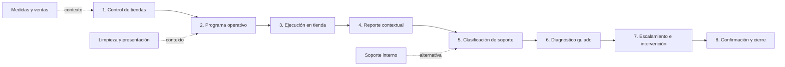

# RTL-DEMO-STORE-OPS-002 — Storyboard de ocho escenas y blueprint de implementación

## Estado

- Versión del blueprint: `0.1.0`
- Estado: Propuesto para aprobación visual y funcional
- Preparado: `2026-08-19`
- Contrato padre: `RTL-DEMO-STORE-OPS-001 v0.1.0`
- Baseline de origen: `ca74d6b369ef58be0140cdbb92d61ed6f2d7e6cf`
- Escenario objetivo: `retail-store-operations`
- Distribución vigente: `public-demo` para la variante neutral

## Resultado buscado

Traducir el contrato operativo de tiendas y soporte en un recorrido implementable. El blueprint
define escenas, actores, pantallas, datos, transiciones, componentes reutilizables, extensiones de
dominio, comportamiento responsive, divulgación de simulaciones y validaciones.

Este documento no implementa el escenario. Su función es evitar que diseño o desarrollo tengan que
inventar el proceso durante la construcción.

## Narrativa principal

La gerencia distribuye el protocolo diario de apertura, limpieza y presentación. El encargado de
una tienda lo ejecuta y detecta una temperatura fuera del rango demostrativo en el área de venta.
Desde el mismo protocolo reporta la incidencia de climatización.

El centro de soporte clasifica el caso como P2, asigna un diagnóstico remoto seguro y recibe los
resultados. Como el problema persiste, escala la atención a un proveedor externo. La tienda confirma
que la temperatura volvió al rango y soporte cierra el caso con la trazabilidad completa.

Esta historia demuestra programa operativo, activos, protocolos, captura en tienda, solicitud de
soporte, SLA, diagnóstico guiado, soporte externo, confirmación y cierre sin cambiar de producto.

## Flujo de escenas



## Contrato resumido del recorrido

| Escena | Actor               | Superficie                      | Decisión principal                               | Entrada                     | Salida                           |
| ------ | ------------------- | ------------------------------- | ------------------------------------------------ | --------------------------- | -------------------------------- |
| 1      | Gerencia / Soporte  | Centro de operación de tiendas  | ¿Qué tienda o compromiso requiere atención?      | Estado inicial              | Tienda principal seleccionada    |
| 2      | Gerencia            | Programa operativo              | ¿Qué protocolo se distribuye, cuándo y a quién?  | Borrador                    | Asignaciones publicadas          |
| 3      | Encargado de tienda | Mi operación                    | ¿La tienda está lista para operar?               | Asignación reconocida       | Desviación detectada             |
| 4      | Encargado de tienda | Paso de incidencia en protocolo | ¿Qué ocurre, dónde y qué impacto tiene?          | Desviación de climatización | Caso reportado                   |
| 5      | Centro de soporte   | Bandeja y detalle de soporte    | ¿Prioridad, ruta y protocolo de diagnóstico?     | Caso por clasificar         | Diagnóstico remoto asignado      |
| 6      | Encargado / Soporte | Ejecución guiada y seguimiento  | ¿El protocolo seguro resolvió el problema?       | Diagnóstico asignado        | No resuelto; escalamiento pedido |
| 7      | Soporte / Proveedor | Intervención y trazabilidad     | ¿Quién atenderá y qué evidencia debe entregar?   | Caso escalado               | Solución pendiente de confirmar  |
| 8      | Tienda / Soporte    | Confirmación, cierre y reporte  | ¿La operación fue restablecida y puede cerrarse? | Solución registrada         | Caso cerrado                     |

## Escena 1 — Centro de operación de tiendas

### Propósito

Mostrar en una sola vista el programa del día, cumplimiento por tienda y solicitudes activas sin
convertir la página en un tablero ejecutivo desconectado de la operación.

### Contrato de pantalla

- **Rol:** Gerencia de sucursales o Centro interno de soporte.
- **Entrada:** reloj demo fijo, datos reiniciados y ninguna acción del recorrido ejecutada.
- **Superficie:** evolución del Centro de control compartido.

### Composición

1. Encabezado `Operación de tiendas` con fecha y cobertura.
2. Retícula de tres columnas:
   - programa de hoy y cumplimiento;
   - tiendas con atención;
   - solicitudes de soporte y SLA.
3. `Programa del día` debajo, con protocolos, tienda, responsable, ventana y estado.
4. Acciones directas `Ver tienda`, `Ver ejecución` y `Ver solicitud`.
5. Indicadores secundarios: pendientes de inicio, vencimientos, reaperturas y soporte externo.

### Datos visibles

- Seis tiendas ficticias.
- Protocolo `Apertura, limpieza y presentación` asignado a todas.
- Cinco ejecuciones en diferentes estados.
- Tres solicitudes de soporte: P1, P2 y P3.
- Un caso externo y uno interno como contexto.

### Acción y transición

El presentador selecciona `Boutique Norte` y abre el programa operativo. No se altera estado en esta
escena.

### Prueba visible

La audiencia distingue compromisos operativos de solicitudes de soporte y comprende que ambos se
relacionan con tiendas, responsables y activos.

## Escena 2 — Distribución del programa operativo

### Propósito

Demostrar que gerencia publica un protocolo versionado a varias tiendas y obtiene ejecuciones
independientes.

### Contrato de pantalla

- **Rol:** Gerencia de sucursales.
- **Superficie:** `Programa operativo`, reutilizando programación y asignación.
- **Entrada:** protocolo listo en borrador.

### Composición

1. Protocolo, versión y objetivo.
2. Tiendas incluidas y excepciones.
3. Fecha, recurrencia y ventana.
4. Responsable por tienda.
5. Evidencias y respuestas obligatorias.
6. Política de validación.
7. Resumen previo a publicar.

### Acción y transición

`Publicar programa` crea una asignación por tienda. La acción muestra confirmación explícita y no
envía comunicaciones reales.

```text
ProgramDraft
→ Published
→ StoreAssignment × N
```

### Prueba visible

La tienda principal aparece `Pendiente de iniciar`; otra puede estar completada y otra vencida sin
compartir estado.

## Escena 3 — Apertura y revisión en tienda

### Propósito

Mostrar al encargado una experiencia enfocada, segura y guiada para realizar el protocolo del día.

### Contrato de pantalla

- **Rol:** Encargado de tienda.
- **Superficie:** `Mi operación`, en escritorio compacto y móvil.
- **Entrada:** asignación reconocida y lista para iniciar.

### Pasos representativos

1. Confirmar apertura y personal responsable.
2. Validar limpieza y orden.
3. Revisar presentación y escaparate.
4. Registrar temperatura del piso de venta.
5. Confirmar POS, impresora y conectividad visual.
6. Enviar observaciones o completar.

Los valores son demostrativos. La temperatura no procede de un sensor real.

### Acción y transición

El encargado registra una temperatura fuera del rango configurado. El protocolo revela la acción
`Reportar y solicitar soporte` sin obligarlo a abandonar la ejecución.

### Prueba visible

Los pasos completados permanecen guardados y la desviación queda asociada a tienda, área, actor,
fecha y versión del protocolo.

## Escena 4 — Reporte contextual desde el protocolo

### Propósito

Evitar recaptura y demostrar que la solicitud nace con suficiente contexto para iniciar soporte.

### Contrato de pantalla

- **Rol:** Encargado de tienda.
- **Superficie:** panel o modal dentro del paso de climatización.
- **Entrada:** desviación activa en la ejecución.

### Campos

- Área afectada: `Piso de venta`.
- Activo: `Unidad de climatización CLM-02`.
- Síntoma: `Temperatura elevada y flujo de aire reducido`.
- Impacto: `Operación degradada; tienda continúa abierta`.
- Evidencia: lectura manual y dos fotografías ficticias.
- Acciones realizadas: heredadas del protocolo.
- Prioridad sugerida: `P2`.

### Acción y transición

`Enviar a soporte` crea `SupportCase RTL-SUP-2048` y devuelve al protocolo. La ejecución queda
`En curso con incidencia reportada`, no `Fallida` ni `Cerrada`.

### Prueba visible

El recibo muestra identificador, fecha, prioridad sugerida y enlace al seguimiento. No aparece una
orden de trabajo porque aún no existe intervención especializada.

## Escena 5 — Clasificación del centro de soporte

### Propósito

Mostrar que soporte recibe contexto, confirma prioridad y decide la primera ruta de resolución.

### Contrato de pantalla

- **Rol:** Centro interno de soporte.
- **Superficie:** `Solicitudes de soporte` con tabla buscable y detalle lateral o página completa.
- **Entrada:** `RTL-SUP-2048 · Por clasificar`.

### Composición del detalle

1. Tienda, área, activo y estado de operación.
2. Protocolo y ejecución de origen.
3. Respuestas y evidencia heredadas.
4. Prioridad sugerida frente a prioridad confirmada.
5. Relojes separados de acuse y objetivo de resolución.
6. Historial y responsable actual.
7. Protocolos de diagnóstico aplicables.
8. Ruta interna o especialidad externa candidata.

### Acción y transición

El agente confirma P2, acusa el caso y asigna `Diagnóstico seguro de climatización en tienda` al
encargado.

```text
Reported
→ Triaged
→ DiagnosticProtocolAssigned
```

### Prueba visible

El SLA conserva tiempos separados y la selección del protocolo explica acciones permitidas y pasos
bloqueados por seguridad.

## Escena 6 — Diagnóstico guiado y decisión

### Propósito

Probar que el personal de tienda puede colaborar con soporte sin ejecutar actividades técnicas o
riesgosas.

### Contrato de pantalla

- **Roles:** Encargado de tienda y Centro de soporte.
- **Superficie:** protocolo guiado en tienda con seguimiento visible para soporte.
- **Entrada:** diagnóstico asignado.

### Pasos seguros

1. Confirmar lectura del termostato.
2. Revisar obstrucciones visibles sin desmontar equipos.
3. Confirmar puertas y fuentes de calor cercanas.
4. Tomar fotografía del panel sin abrirlo.
5. Ejecutar un reinicio autorizado sólo si el protocolo lo habilita.
6. Registrar nueva temperatura y condición.

### Restricciones

- No abrir tableros ni equipos.
- No manipular instalaciones eléctricas.
- No trabajar en altura.
- No simular telemetría o diagnóstico automático.

### Acción y transición

El resultado `El problema continúa` habilita `Solicitar intervención`. El caso preserva el
diagnóstico y queda `Escalamiento requerido`.

### Prueba visible

Soporte ve los pasos, respuestas y evidencia sin solicitar que la tienda los envíe nuevamente por
otro canal.

## Escena 7 — Enrutamiento e intervención externa

### Propósito

Demostrar control del handoff entre centro de soporte y proveedor sin pretender que existe un portal
externo o integración real.

### Contrato de pantalla

- **Roles:** Centro de soporte; proveedor representado como entidad.
- **Superficie:** sección `Intervención` dentro del caso.
- **Entrada:** diagnóstico no resuelto.

### Composición

1. Especialidad requerida: climatización.
2. Candidatos internos y externos con disponibilidad simulada.
3. Ventana propuesta y acceso a tienda.
4. Alcance y evidencia requerida.
5. Responsable de coordinación.
6. Bitácora de comunicaciones simuladas.

### Acción y transición

`Asignar proveedor` crea una intervención ligada al caso. El presentador avanza mediante un estado
preparado donde el proveedor registró visita, actividad y evidencia por medio del centro de soporte.

```text
EscalationRequired
→ ExternalAssigned
→ Scheduled
→ InService
→ ResolutionRecorded
```

### Prueba visible

La solicitud, diagnóstico y evidencia inicial permanecen disponibles; la intervención agrega una
nueva capa y no reemplaza el caso.

## Escena 8 — Confirmación, validación y cierre

### Propósito

Cerrar sólo cuando la tienda confirma la recuperación y soporte cumple la política aplicable.

### Contrato de pantalla

- **Roles:** Encargado de tienda y Centro de soporte.
- **Superficie:** confirmación en tienda seguida de expediente consolidado.
- **Entrada:** solución registrada por proveedor.

### Acciones

1. El encargado ejecuta una verificación final de climatización.
2. Registra temperatura demostrativa dentro del rango.
3. Confirma `Operación restablecida` o solicita reapertura.
4. Soporte revisa evidencia, confirmación y SLA.
5. `Cerrar solicitud` congela el expediente.

### Reporte final

- tienda, área y activo;
- asignación y protocolo que originaron el caso;
- síntoma, impacto y prioridad;
- diagnóstico remoto y respuestas;
- ruta interna/externa;
- intervención y evidencia;
- confirmación de tienda;
- decisiones, revisiones y tiempos;
- divulgación de simulación.

### Mensaje final

`Solicitud cerrada · Operación confirmada por tienda · Evidencia consolidada`.

El recorrido termina aquí. La analítica agregada queda como contexto secundario, no como novena
escena.

## Arquitectura de información propuesta

### Administración / Gerencia

1. Centro de operación de tiendas.
2. Programa operativo.
3. Solicitudes de soporte.
4. Tiendas y activos.
5. Protocolos.
6. Proveedores e intervenciones.
7. Análisis.

### Mi operación

1. Programa de hoy.
2. Protocolos asignados.
3. Solicitudes y seguimiento.
4. Historial de la tienda.

### Supervisión

1. Alertas y SLA.
2. Validaciones.
3. Reaperturas.
4. Cumplimiento de tiendas.

Los nombres deben provenir de configuración de experiencia. No deben reemplazar de forma global los
nombres de ATM, Industrial o Wire.

## Blueprint de componentes

### Reutilizar sin cambio conceptual (`REUSE`)

| Área compartida          | Uso en Retail                                             |
| ------------------------ | --------------------------------------------------------- |
| `AppShell` y perfiles    | Roles, login, navegación y contexto.                      |
| Tablas inteligentes      | Búsqueda, filtros, ordenamiento y selección.              |
| Perfil de activo         | Contexto, condición, documentos, incidencias e historial. |
| Protocolos y formularios | Pasos, respuestas, evidencia y criterios.                 |
| Ejecución móvil          | Experiencia enfocada del encargado.                       |
| Incidencias y bitácora   | Registro, trazabilidad y notificaciones.                  |
| Validación y revisiones  | Devolución, reapertura, aprobación e historial.           |
| Reportes e impresión     | Expediente consolidado y entrega simulada.                |

### Extender genéricamente (`EXTEND`)

| Área actual                | Extensión requerida                                                             |
| -------------------------- | ------------------------------------------------------------------------------- |
| Centro de control          | Programa de tiendas, excepciones y solicitudes con SLA.                         |
| Programación               | Publicación multi-tienda y recurrencia operativa.                               |
| `ServiceInbox`             | Soporte, prioridad, diagnóstico y rutas internas/externas.                      |
| Ejecución de protocolo     | Paso `issue-report` que crea un caso sin perder la ejecución.                   |
| Perfil de activo           | Mostrar tienda, área, soporte activo y protocolos aplicables.                   |
| Validación                 | Resolver autoridad desde la política del protocolo y soporte.                   |
| Reporte                    | Unir ejecución de origen, caso, diagnóstico, intervención y confirmación.       |
| Configuración de escenario | Etiquetas de tienda, catálogo de protocolos, prioridades y políticas de cierre. |

### Nuevas responsabilidades reutilizables (`NEW`)

| Componente / dominio     | Responsabilidad                                                   |
| ------------------------ | ----------------------------------------------------------------- |
| `OperationalProgram`     | Publicar protocolos a múltiples entidades operativas.             |
| `OperationalAssignment`  | Representar una instancia independiente por tienda y responsable. |
| `SupportCaseDetail`      | Controlar diagnóstico, SLA, ruta, intervenciones y confirmación.  |
| `SupportRouting`         | Seleccionar soporte interno, externo o escalamiento de seguridad. |
| `SupportIntervention`    | Registrar una atención especializada ligada al caso.              |
| `ResolutionConfirmation` | Aplicar confirmación y autoridad de cierre configurables.         |

Los nombres son conceptuales y pueden ajustarse a las convenciones del código. Sus
responsabilidades no deben fusionarse en una pantalla específica del cliente.

## Blueprint de dominio

```ts
type OperationalAssignmentStatus =
  "Assigned" | "Acknowledged" | "InProgress" | "Submitted" | "Returned" | "Validated" | "Completed";

type SupportPriority = "P1" | "P2" | "P3" | "P4";

type SupportCaseStatus =
  | "Reported"
  | "Triaged"
  | "DiagnosticProtocolAssigned"
  | "Diagnosing"
  | "EscalationRequired"
  | "InternalAssigned"
  | "ExternalAssigned"
  | "Scheduled"
  | "InService"
  | "PendingStoreConfirmation"
  | "PendingSupportValidation"
  | "Closed"
  | "Reopened";

type SupportCase = {
  id: string;
  storeId: string;
  areaId?: string;
  assetId?: string;
  sourceExecutionId?: string;
  sourceProtocolVersion?: string;
  symptom: string;
  operationalImpact: string;
  suggestedPriority: SupportPriority;
  confirmedPriority?: SupportPriority;
  acknowledgementDueAt?: string;
  resolutionTargetAt?: string;
  status: SupportCaseStatus;
  currentOwnerId?: string;
  interventionIds: string[];
};
```

### Invariantes

- La asignación de una tienda nunca muta la asignación de otra.
- El caso conserva la prioridad sugerida y la confirmada.
- La intervención no puede existir sin un caso.
- El cierre exige la política configurada y la última revisión aprobada.
- La reapertura no elimina el cierre ni la evidencia anteriores.
- Los componentes solicitan acciones de dominio; no deciden transiciones por su cuenta.

## Configuración candidata

El perfil `retail-store-support` debe componerse de capacidades genéricas. La primera implementación
debe revisar si `execution-only` puede extenderse sin introducir un nuevo perfil.

```ts
type StoreOperationsConfig = {
  operationalProtocolCategories: string[];
  supportPriorities: SupportPriorityDefinition[];
  supportRoutes: SupportRouteDefinition[];
  closurePolicies: ClosurePolicyDefinition[];
  storeSafetyRules: SafetyRuleDefinition[];
  externalProviderPortalEnabled: false;
};
```

No se permiten condicionales de pantalla como
`scenario.id === "retail-store-operations"`. La navegación, etiquetas y comportamiento deben
derivarse de capacidades y configuración.

## Seed determinista propuesto

### Reloj

- Hora del recorrido: `2026-08-20T09:15:00-06:00`.
- Clave de estado candidata: `zellship-store-operations-retail-v1`.

Son fixtures, no fechas ni eventos reales.

### Tiendas ficticias

| ID      | Nombre público   | Estado de historia              |
| ------- | ---------------- | ------------------------------- |
| STR-001 | Boutique Norte   | Historia principal              |
| STR-002 | Boutique Centro  | Protocolo completado            |
| STR-003 | Boutique Valle   | Apertura pendiente              |
| STR-004 | Boutique Parque  | Caso P1 de POS como contexto    |
| STR-005 | Boutique Sur     | Soporte interno en diagnóstico  |
| STR-006 | Boutique Oriente | Intervención externa completada |

### Registros principales

| ID           | Tipo                    | Estado inicial          | Propósito                      |
| ------------ | ----------------------- | ----------------------- | ------------------------------ |
| RTL-ASG-1024 | Apertura y presentación | `Acknowledged`          | Ejecución principal            |
| RTL-SUP-2048 | Climatización           | Se crea en escena 4     | Caso principal                 |
| RTL-SUP-2039 | POS                     | `Triaged · P1`          | Urgencia visible               |
| RTL-SUP-2041 | Conectividad            | `Diagnosing · P3`       | Resolución interna secundaria  |
| RTL-SUP-2027 | Iluminación             | `ExternalAssigned · P3` | Proveedor externo visible      |
| RTL-SUP-2018 | Impresora               | `Closed · P4`           | Expediente final de referencia |

Todos los nombres, imágenes, personas, teléfonos, correos, ubicaciones e indicadores deben ser
ficticios para una versión pública.

## Comportamiento responsive

### Escritorio

- Escenas 1, 2, 5, 7 y 8 utilizan el shell administrativo.
- La decisión seleccionada debe quedar arriba del primer pliegue en 1440 × 900.
- La bandeja conserva búsqueda, filtros y ordenamiento.
- SLA usa texto e icono además de color.
- El detalle puede ser drawer sólo si conserva acciones y contexto sin desplazamiento horizontal.

### Móvil

- Escenas 3, 4 y 6 usan la experiencia enfocada de tienda.
- Un paso principal por pantalla.
- Acción primaria fija y accesible.
- Sin desplazamiento horizontal a 390 px.
- Reportar incidencia no borra ni reinicia el protocolo.
- Riesgos y restricciones de seguridad aparecen antes de la acción.

### Reporte

- Formato carta, jerarquía empresarial y sin controles interactivos impresos.
- Evidencia como soporte, no como elemento dominante.
- No separar etiquetas de fotografías cuando sea posible.
- Pie de página con divulgación de simulación.

## Contrato de lenguaje

### Utilizar

- `Programa operativo`.
- `Mi operación`.
- `Solicitud de soporte`.
- `Diagnóstico guiado`.
- `Atención interna` y `Proveedor externo`.
- `Pendiente de confirmación de tienda`.
- `Operación restablecida`.
- `Expediente consolidado`.

### Evitar

- `Orden de trabajo` para toda solicitud.
- `SLA cumplido` cuando sólo se registró acuse.
- `Sensor confirmó` o `diagnóstico automático`.
- `Mensaje enviado` sin aviso de simulación.
- `Integrado con proveedor` sin integración real.
- indicadores o ahorros presentados como datos productivos.

## Secuencia de implementación propuesta

### Incremento 1 — Contrato de escenario y datos

- confirmar identidad neutral/restringida;
- definir protocolo, asignación, caso, intervención y confirmación;
- registrar escenario con clave de persistencia propia;
- agregar fixtures ficticios y pruebas de contrato.

### Incremento 2 — Programa y ejecución en tienda

- escenas 1–3;
- publicación multi-tienda;
- programa de hoy y ejecución enfocada;
- protocolos iniciales y reglas de seguridad.

### Incremento 3 — Solicitud y diagnóstico

- escenas 4–6;
- reporte dentro del protocolo;
- bandeja, prioridad, SLA y diagnóstico guiado;
- continuidad entre ejecución y caso.

### Incremento 4 — Enrutamiento y cierre

- escenas 7–8;
- soporte interno/externo;
- intervención, confirmación, reapertura y expediente;
- impresión y entrega simulada.

### Incremento 5 — QA del recorrido

- reset determinista;
- validación de roles y autoridades;
- 1440 × 900 y 390 px;
- impresión carta;
- regresión Industrial, ATM y Wire;
- auditoría de datos y divulgación de simulaciones;
- autorización explícita antes de publicar.

## Matriz de aceptación

| ID       | Escena | Criterio verificable                                                                          |
| -------- | ------ | --------------------------------------------------------------------------------------------- |
| RTL-AC01 | 1      | Programa operativo y solicitudes de soporte aparecen como conceptos diferentes.               |
| RTL-AC02 | 1      | `Ver tienda`, `Ver ejecución` y `Ver solicitud` abren el registro seleccionado.               |
| RTL-AC03 | 2      | Publicar crea una asignación independiente por tienda y conserva versión del protocolo.       |
| RTL-AC04 | 2      | Cambiar una asignación no modifica las demás.                                                 |
| RTL-AC05 | 3      | El encargado sólo ve protocolos y acciones autorizados para su tienda y rol.                  |
| RTL-AC06 | 3      | La desviación de temperatura usa un fixture visible y no se atribuye a telemetría real.       |
| RTL-AC07 | 4      | Reportar crea un caso ligado a tienda, activo, ejecución, respuestas y evidencia.             |
| RTL-AC08 | 4      | Después de reportar, el protocolo conserva progreso y puede continuar.                        |
| RTL-AC09 | 5      | Prioridad sugerida y confirmada permanecen visibles y auditables.                             |
| RTL-AC10 | 5      | Acuse y objetivo de resolución se muestran como tiempos separados.                            |
| RTL-AC11 | 6      | El protocolo de tienda excluye pasos de riesgo y explica por qué debe escalarse.              |
| RTL-AC12 | 6      | Un diagnóstico no resuelto conserva respuestas y habilita intervención.                       |
| RTL-AC13 | 7      | Intervención interna o externa se liga al caso sin reemplazar su trazabilidad.                |
| RTL-AC14 | 7      | Proveedor externo no aparece como usuario autenticado ni integración real en v1.              |
| RTL-AC15 | 8      | El cierre exige la confirmación y validación configuradas.                                    |
| RTL-AC16 | 8      | Reabrir conserva cierre, motivo, actor, fecha y evidencia anteriores.                         |
| RTL-AC17 | 8      | El reporte consolida asignación, ejecución, caso, diagnóstico, intervención y confirmación.   |
| RTL-AC18 | Todas  | Mensajería, archivos, SLA, diagnóstico, sensores y proveedores simulados están identificados. |
| RTL-AC19 | Todas  | Reset restaura el recorrido original sin compartir estado con otros escenarios.               |
| RTL-AC20 | Todas  | Industrial, ATM y Wire mantienen navegación, datos, roles, builds y pruebas sin regresión.    |
| RTL-AC21 | Todas  | Ningún dato identificable del prospecto aparece en un artefacto público sin autorización.     |
| RTL-AC22 | Todas  | El recorrido se completa en 8–10 minutos sin edición manual de estado ni botones muertos.     |

## Plan de verificación

### Automatizado

- validación de identidad, distribución y persistencia del escenario;
- independencia de asignaciones multi-tienda;
- creación contextual de casos;
- prioridad sugerida frente a confirmada;
- transiciones legales e ilegales de diagnóstico e intervención;
- políticas de cierre por protocolo y soporte;
- historial inmutable de reapertura;
- restricciones de seguridad y autoridad por rol;
- reset determinista;
- regresión de todos los escenarios;
- `npm run check:release` y ensamblado de Pages sólo cuando exista autorización.

### Visual

- Escena 1 a 1440 × 900: decisión y programa principal arriba del pliegue.
- Escena 3 a 390 px: pasos y acción principal sin overflow.
- Escena 4 a 390 px: reporte contextual sin perder progreso.
- Escena 5 a 1440 × 900: contexto, SLA, diagnóstico y acción visibles.
- Escena 7 a 1440 × 900: caso e intervención distinguibles.
- Escena 8 en carta: evidencia legible, sin controles ni cortes críticos.

## Preguntas abiertas

### Bloqueantes antes de implementar una versión identificada

1. ¿Se autoriza utilizar nombre y logotipo del prospecto en un artefacto restringido?
2. ¿Qué activos y acciones puede manipular con seguridad el encargado de tienda?
3. ¿La demo deberá ejecutarse en este repositorio o integrarse después al showcase de Harris &
   Frank?

### Resolubles durante el escenario neutral

1. ¿Cuántas tiendas ficticias deben aparecer en el recorrido?
2. ¿Qué SLA demostrativos conviene usar comercialmente?
3. ¿Qué protocolos comerciales requieren validación de gerencia?
4. ¿Qué especialidades internas y externas se muestran?

## Gate de salida

No iniciar implementación hasta aprobar:

- contrato `RTL-DEMO-STORE-OPS-001`;
- ocho escenas y narrativa principal;
- matriz `REUSE / EXTEND / NEW`;
- política de datos y distribución;
- límites de seguridad para protocolos en tienda;
- repositorio y ruta de publicación objetivo.
